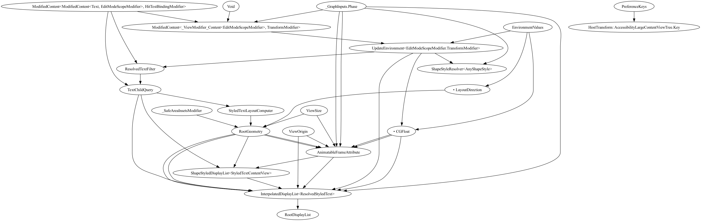

## [WIP] GraphConvert

Convert ag-json graph json file to GraphViz graph model.

The package currently is in early preview. The graph converter logic is not yet fully complete.

## Usage

```shell
swift build -c release
cp <GraphConverter binary> ./
./GraphConverter -i xx -o xx -f {dot, png, svg, etc}
```

## Example


